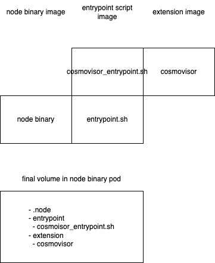

# Design for node operator

This operator will allow provision of Cosmos nodes as well as:
1. Relayer
2. Cosmovisor
   
## Node

* node will use heighliner image
  * create an entrypoint.sh
  * create an image that hosts this entrypoint.sh
* entrypoint script will be stored in an image and mount on to node volume
  * create a pvc if not exists
  * combine component image files into pvc
  * mount pvc onto Pod
* chain binary will call entrypoint script